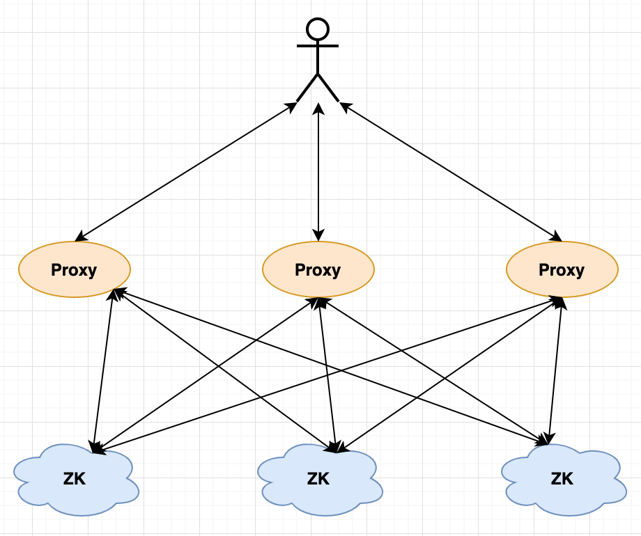

**English** | [中文](./Readme_CN.md)
<p align="center">

<br>
</p>
<br>
<br>
<br>


### Features
- Proxy
- Logging
- Ip acl for node (support inheritance)
- Ratelimit

### Architecture Overview
<center>

</center>

### Benchmark

```
BenchmarkProxyGet-48               10000            144907 ns/op
BenchmarkZKGet-48                  10000            102587 ns/op
BenchmarkProxyConnGet-48            1000           2211095 ns/op
BenchmarkZKConnGet-48               1000           1825001 ns/op
BenchmarkProxyCreateSet-48          2000            799873 ns/op
BenchmarkZKCreateSet-48             2000            658289 ns/op
```

### Install
- Change zoo.cfg

```
maxClientCnxns=1000000
```

- Build proxy

```
cd zk-proxy
sh build.sh
```
- Monitor proxy

```
echo isok|nc 127.1 2182
echo info|nc 127.1 2182
echo sess|nc 127.1 2182
curl http://127.1:8000/debug/vars
```

### Thanks
- [https://github.com/samuel/go-zookeeper](https://github.com/samuel/go-zookeeper)
- [https://github.com/etcd-io/zetcd](https://github.com/etcd-io/zetcd)